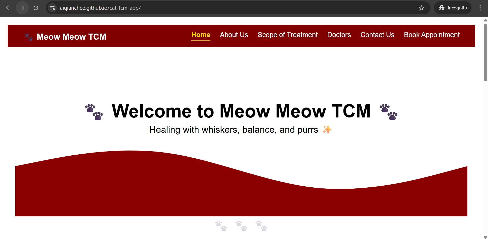
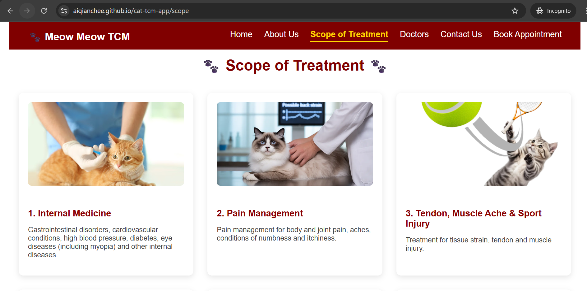

🐾 Cat TCM Web Application

A full-stack web application for Cat TCM (Traditional Chinese Medicine) built with:
Frontend: React (cat-tcm-frontend)
Backend: Spring Boot (Meow)
API: RESTful endpoints for About Us, Scope of Treatment, Contact, etc.

## 🌐 Live Demo
https://aiqianchee.github.io/cat-tcm-app/

## 🚀 Key Highlights
- Built a multi-page React application using React Router
- Deployed frontend using GitHub Pages and handled routing issues with basename configuration
- Designed RESTful APIs using Spring Boot for modular backend services
- Structured project as a full-stack application with clear frontend-backend separation
- Implemented dynamic UI components for treatment listings and clinic information

## 🛠 Tech Stack
- Frontend: React, React Router, CSS
- Backend: Spring Boot (Java)
- API: RESTful services
- Deployment: GitHub Pages (Frontend)

## 📸 Screenshots

📂 Project Structure
.
├── Meow/                # Spring Boot backend (Java + Maven)
│   ├── src/main/java    # Application source code
│   ├── src/main/resources
│   └── pom.xml          # Maven build file
│
├── cat-tcm-frontend/    # React frontend (Create React App)
│   ├── public/          # Public static assets
│   ├── src/             # React components
│   └── package.json     # NPM dependencies
│
├── .gitignore           # Git ignore rules
├── .gitattributes       # Line ending settings
└── README.md            # Project documentation

⚙️ Prerequisites
Make sure you have installed:
Java 17+
Maven 3+
Node.js 18+ and npm

🚀 Running the Application
1. Run Backend (Spring Boot)
cd Meow
mvn spring-boot:run
Backend will start on: http://localhost:8080

2. Run Frontend (React Dev Server)
cd cat-tcm-frontend
npm install   # first time only
npm start
Frontend will start on: http://localhost:3000

3. Access APIs (examples)
http://localhost:8080/about → About Us JSON
http://localhost:8080/scope → Scope of Treatment JSON
http://localhost:8080/contact → Contact info JSON

📦 Building for Production
Build React:
cd cat-tcm-frontend
npm run build

This creates a build/ folder.

Copy build/ into Spring Boot’s src/main/resources/static/.
Now Spring Boot serves React directly.

Package into one JAR:
cd Meow
mvn clean package
java -jar target/meow-0.0.1-SNAPSHOT.jar

Access everything at: http://localhost:8080

🛠️ Tech Stack
Frontend: React, React Router, Fetch API / Axios
Backend: Spring Boot, REST Controllers
Build Tools: Maven, npm
Deployment: Single JAR (Spring Boot + React)

📌 To-Do / Future Enhancements
 Doctor profiles page
 Appointment booking form
 Database integration (MySQL/PostgreSQL)
 Authentication (Spring Security + JWT)

👨‍💻 Author
Developed by Ai Qian Chee 🐱
